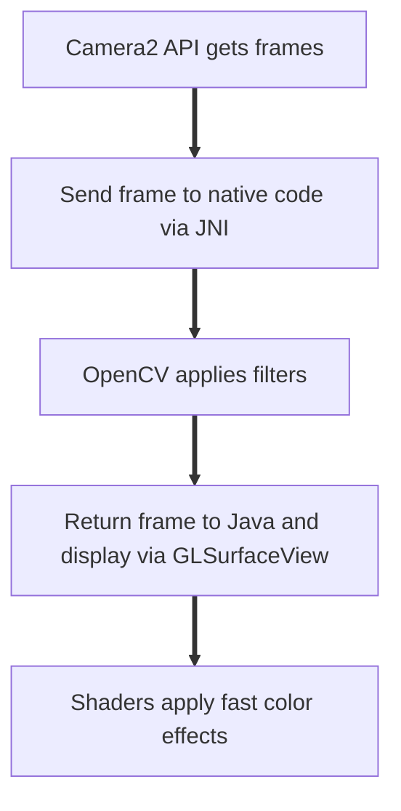

# VisionX

**VisionX** is an Android app that uses device camera and applies filters like grayscale, edge detection, blur, invert colors in real-time. It combines Java (for the app), OpenGL shaders (for fast graphics), and OpenCV (for image processing) while using native C++ code via JNI.


## Features Implemented

- **Raw camera feed** — See the camera feed as it is.
- **Grayscale mode** — Turns colors into black & white.
- **Canny edge detection** — Detects and draws edges (like sketch lines, White over Black).
- **Invert colors** — Flips colors (black becomes white, white becomes black).
- **Gaussian blur** — Smoothens/Blurs the image.
- **Thresholding** — Creates a sharp black & white (binary) image.
- **Button** — Switch filters easily by clicking and see the mode name change.
- **FPS counter** — Shows how fast the frames are processed at the bottom.


## Screenshots

| Raw Mode | Grayscale | Canny Edge Detection |
|----------|-----------|---------------------|
|  |  |  |

| Invert | Blur | Threshold |
|--------|-------|-----------|
|  |  |  |


## Live Demo 
[Download demo.mp4](demo.mp4)

## Setup

### Clone this repo

```bash
git clone https://github.com/ughrima/VisionX.git
cd VisionX
````

### Install Prerequisites

* **Android Studio** (latest stable version recommended)
* **NDK + CMake**
  * Open Android Studio
  * Go to `Tools > SDK Manager > SDK Tools`
  * Check  `NDK (Side by side)` and `CMake`
* **OpenCV**
  * `libopencv_java4.so` files are included under `app/src/main/jniLibs/`
  * No extra download needed.
  
### 3️⃣ Build and run

1. Open the folder in Android Studio
2. Let Gradle sync — it will recognize the NDK and C++ setup
3. Make sure Your device is connected via USB and USB debugging is ON.
4. Allow the app to use camera.
5. Press the green Run button, or Build an APK via
**Build > Build Bundle(s) / APK(s) > Build APK(s)**
7. Done!  The app will open on your device.

## How it works

### Frame flow



## Files

* `MainActivity.java` — The main screen. Opens camera, sets up buttons, FPS counter, and works with the native code.
* `native-lib.cpp` — C++ code that uses OpenCV to process images (grayscale, edge detection etc).
* `CMakeLists.txt` — Tells CMake how to build  C++ code for Android.
* `build.gradle.kts` — The Gradle build file. Handles dependencies, build settings.
* `AndroidManifest.xml` — Declares app permissions (like camera), app name, etc.
* `Render.java` — Handles OpenGL drawing. Displays processed frames on screen.
* `Shade.java` — Loads shader files (fragment/vertex) into OpenGL.
* `fragment.glsl` — Shader for coloring pixels (invert, grayscale).
* `vertex.glsl` — Shader for positioning (where things are drawn).
* `activity_main.xml` — Defines where button, FPS text, camera view go on screen.

 ## Deployment

[Download VisionX APK from GitHub Releases](https://github.com/ughrima/VisionX/releases/latest)

## Some References 

- [Android Developers Documentation](https://developer.android.com/docs)
- [Android NDK](https://developer.android.com/ndk)
- [GLSurfaceView & OpenGL ES](https://developer.android.com/reference/android/opengl/GLSurfaceView) 
- [CMake for Android](https://developer.android.com/studio/projects/install-ndk#cmake)
- [Mermaid JS](https://mermaid.js.org/)


